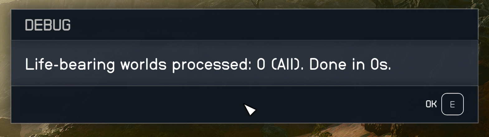

# manual testing

## CompletePlanet

### all

cgf "CompletePlanetSurveyQuest.CompletePlanet" "all"

trait broken = 'complete, but corrupt (0/2 and cannot manually scan)

### resources

cgf "CompletePlanetSurveyQuest.CompletePlanet" "resources"

touched species (flora, fauna) when should not. Resources correct. 

### traits,fauna,flora

cgf "CompletePlanetSurveyQuest.CompletePlanet" "traits,fauna,flora"

correct, untouched resources - correct

traits = shared corrupt functionality - broken completion

### traits

This did NOT do only traits on the planet. It did ALL, thus ignoring my traits only 

## GreenPlanetProper

cgf "CompletePlanetSurveyQuest.GreenPlanetProper"

This implementation is the cleaner approach and should be incorporated to other above commands. 
This command itself should not exist. Users should be using CompletePlanet cmd, and the implementation inside GreenPlanetProper should replace the old method used within CompletePlanet

## CompleteBarrenPlanets

## resources,traits

cgf "CompletePlanetSurveyQuest.CompleteBarrenPlanets" "traits"

Seems to work correctly, though I believe suffers from the same corrupt traits issue where i would not be able to complete/correctly scan trait objects on the planet to fix the 0/N scan.

Observation: some traits dont require scans, while some others might spawn objects, e.g microbe colonies - so depends on the kind of trait?

## CompleteLifePlanets

### traits

cgf "CompletePlanetSurveyQuest.CompleteLifePlanets" "traits"

this commmand correctly completed traits (albiet still with same corrupt bug) and did only target planets with life, which is correct.

### all

This command appeared to work, with the same trait corruption bug depending on the kind of trait which may require scans 0/N?
